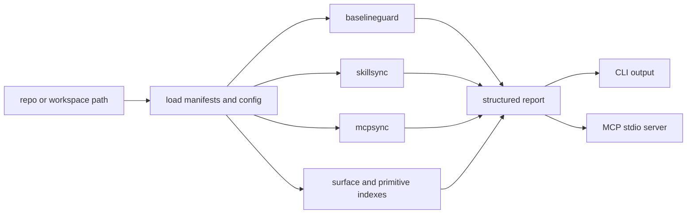

# Portfolio Proof Notes

This page gives reviewers a concise path through the public-safe architecture signal in `codexkit`.

## What This Proves

- Agent-repo hygiene can be represented as repeatable checks instead of tribal setup knowledge.
- Provider-specific generated surfaces can be derived from repo-local source contracts.
- Sync operations should expose diff/check modes before write modes.
- Fleet-scale agent work benefits from stable manifests, source-contract artifacts, and surface indexes.

## Architecture Diagram



## Five-Minute Reviewer Path

```bash
git clone https://github.com/hairglasses-studio/codexkit.git
cd codexkit
make ci
```

The review path is intentionally self-contained. Workspace-wide commands require a caller-provided workspace and should not depend on private machine state.

## Walkthrough Or Demo Plan

1. Run `baseline check .` and show the check categories.
2. Run a dry-run sync command against the included fixture:
   `GOWORK=off go run ./cmd/codexkit skills diff examples/minimal-agent-repo`
   or
   `GOWORK=off go run ./cmd/codexkit mcp diff examples/minimal-agent-repo`.
3. Show how source-contract and index commands produce diffable artifacts.
4. Show the MCP server exposing the same command families.
5. Close by pointing to `PUBLIC_BOUNDARY.md` and the authoritative local CI target.

## Trust Boundary

Included public state: generic repo paths, validation categories, provider projection mechanics, generated artifact schemas, and portable examples.

Excluded private state: private workspace manifests, host overlays, credentials, account identifiers, tenant data, browser state, runtime logs, and machine-specific cache paths.

## Tradeoffs

- The public quickstart validates this repository, not a private fleet. That keeps the path reproducible while still proving the validation architecture.
- Some workspace source-contract commands are most meaningful in a full workspace. The public repo documents their shape but avoids publishing private inventory.
- The toolkit favors check/diff modes before sync modes. That slows mutation slightly but makes agent-driven maintenance safer.

## Interview Deep-Dive Prompts

- How do you keep generated provider configs reproducible across many repos without hiding drift?
- Which repo hygiene checks should fail a build, and which should remain advisory?
- How would you extend a source-contract artifact so multiple AI coding providers can share the same repo facts safely?
